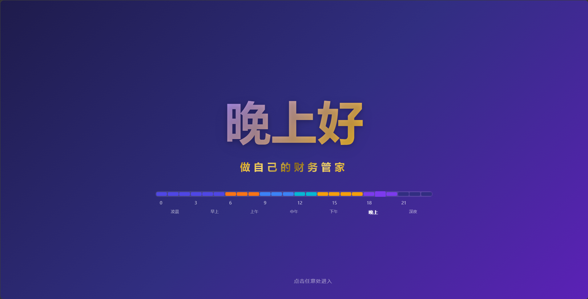
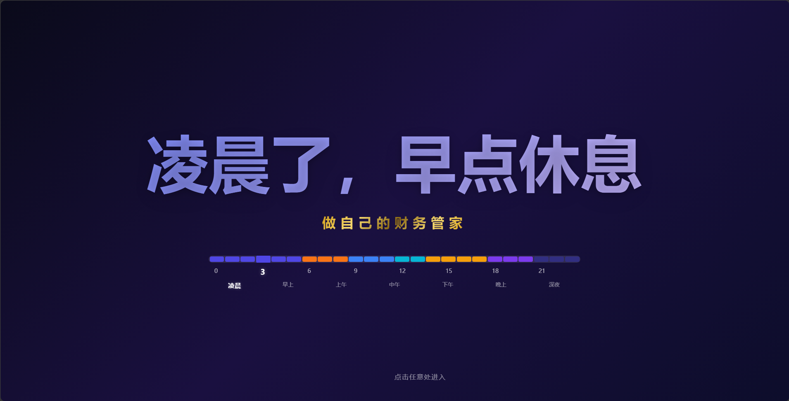
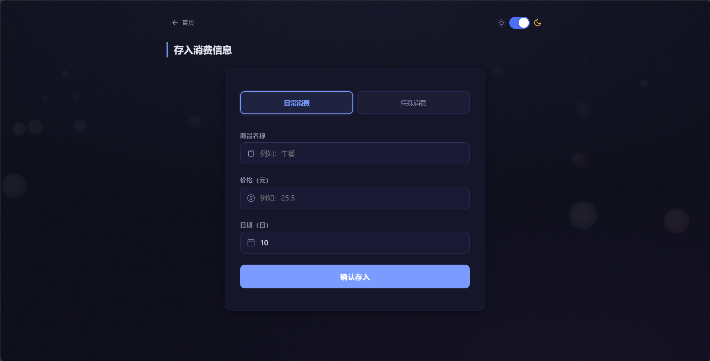
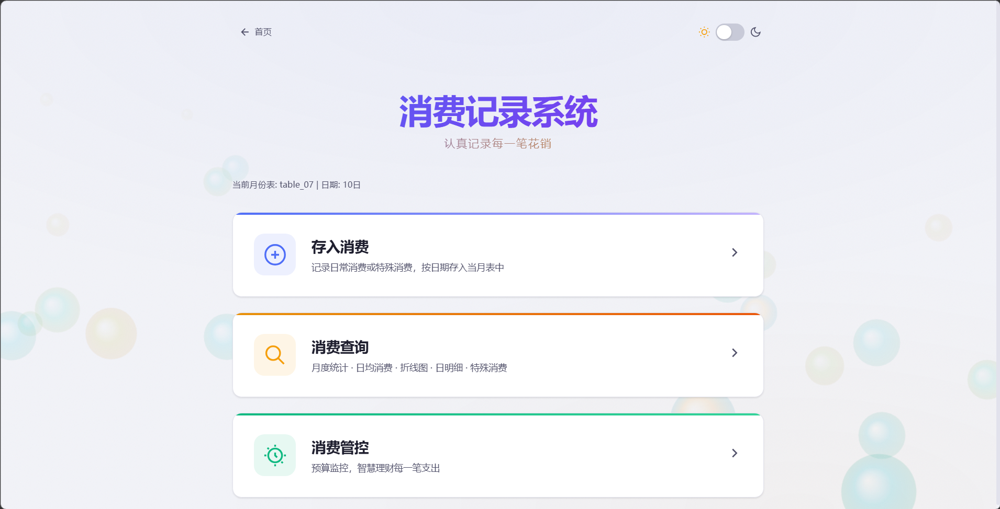
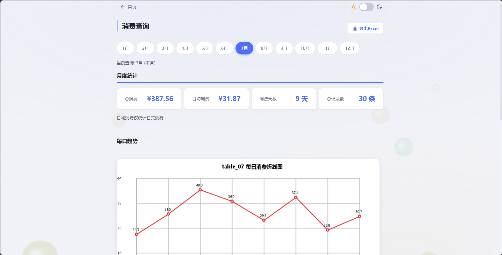
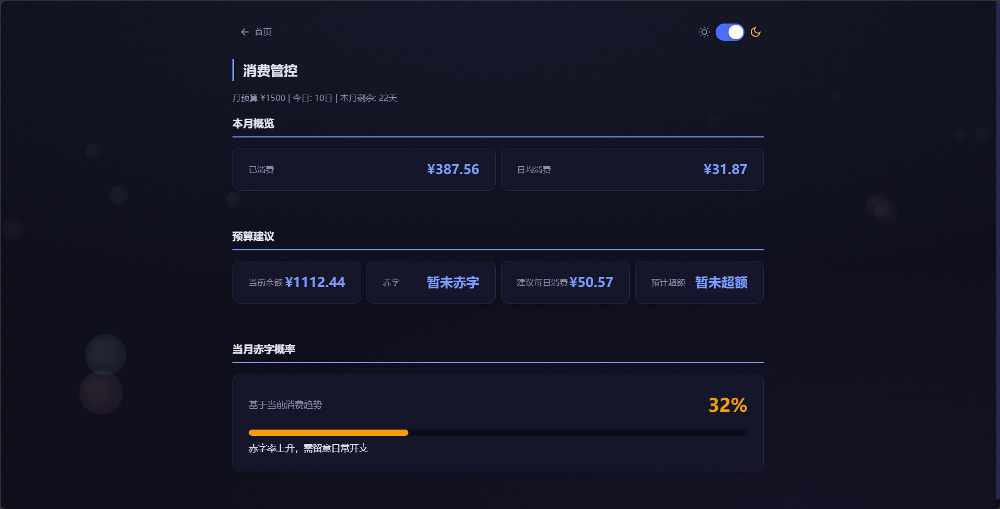

# JAVA-Accounting-system

个人消费记录系统 — 基于 Java 的 Web 应用，支持日常消费记账、消费趋势分析、预算管控等功能。

## 功能

- **存入消费** — 记录日常消费与特殊消费，支持自定义日期
- **消费查询** — 月度统计、日均消费、每日明细、折线图趋势
- **消费管控** — 预算监控、赤字概率评估、预计超额预警
- **Excel 导出** — 一键导出月度消费数据
- **主题切换** — 浅色/深色双模式
- **智能封面** — 根据时段自动切换问候语（凌晨/早上/上午/中午/下午/晚上/深夜）

## 技术栈

| 组件 | 使用 |
|------|------|
| 后端 | Java 17+, JDK HttpServer |
| 前端 | HTML / CSS / JavaScript + Canvas |
| 数据库 | MySQL |
| 图表 | JDK Graphics2D 自绘折线图 |
| 动画 | Canvas 粒子系统 + CSS Animations |

## 快速开始

### 前置条件

- JDK 17+
- MySQL 8.0+

### 数据库配置

1. 创建数据库：

```sql
CREATE DATABASE Cost_system;
```

2. 为每个月创建数据表（格式 `table_01` ~ `table_12`）：

```sql
CREATE TABLE table_01 (
  id INT AUTO_INCREMENT PRIMARY KEY,
  date INT NOT NULL,
  goods VARCHAR(100) NOT NULL,
  price DECIMAL(10,2) NOT NULL,
  num_1 INT DEFAULT 1
);
```

按月份创建 `table_01` 至 `table_12` 共 12 张表。

### 配置数据库连接

修改 [src/function/One.java](src/function/One.java) 中的数据库连接信息：

```java
private static final String URL = "jdbc:mysql://localhost:3306/Cost_system?useSSL=false&serverTimezone=UTC";
private static final String USER = "root";
private static final String PWD = "你的密码";
```

### 运行

1. 用 IDEA 打开项目
2. 将 `lib/` 目录下的所有 jar 添加为项目库
3. 运行 [src/System/The_main.java](src/System/The_main.java) 的 `main()` 方法
4. 浏览器自动打开 `http://localhost:8080`

> 首次访问会展示欢迎封面，点击后进入主菜单。

## 项目结构

```
src/
├── System/
│   └── The_main.java     # 程序入口
└── function/
    ├── One.java           # 数据库连接工具
    ├── Date_time.java     # 日期时间工具
    ├── Line.java          # 折线图生成
    ├── Menu.java          # 终端菜单（保留兼容）
    └── WebServer.java     # Web 服务器 + 所有页面逻辑
```

## 界面截图

| 页面 | 预览 |
|------|------|
| **智能问候封面** — 7 时段自适应问候 + 24 小时时间线 |  |
| **首页主菜单** — 功能卡片导航 |  |
| **存入消费** — 选择类型、填写商品与价格 |  |
| **消费查询** — 月度统计与日消费明细 |  |
| **消费折线图** — 每日消费趋势可视化 |  |
| **日消费明细** — 查看、编辑、删除记录 |  |
| **特殊消费** — 固定支出分类查看 |  |
| **消费管控** — 预算监控、赤字概率、超额预警 |  |
| **Excel 导出** — 日常与特殊消费分列导出 |  |
